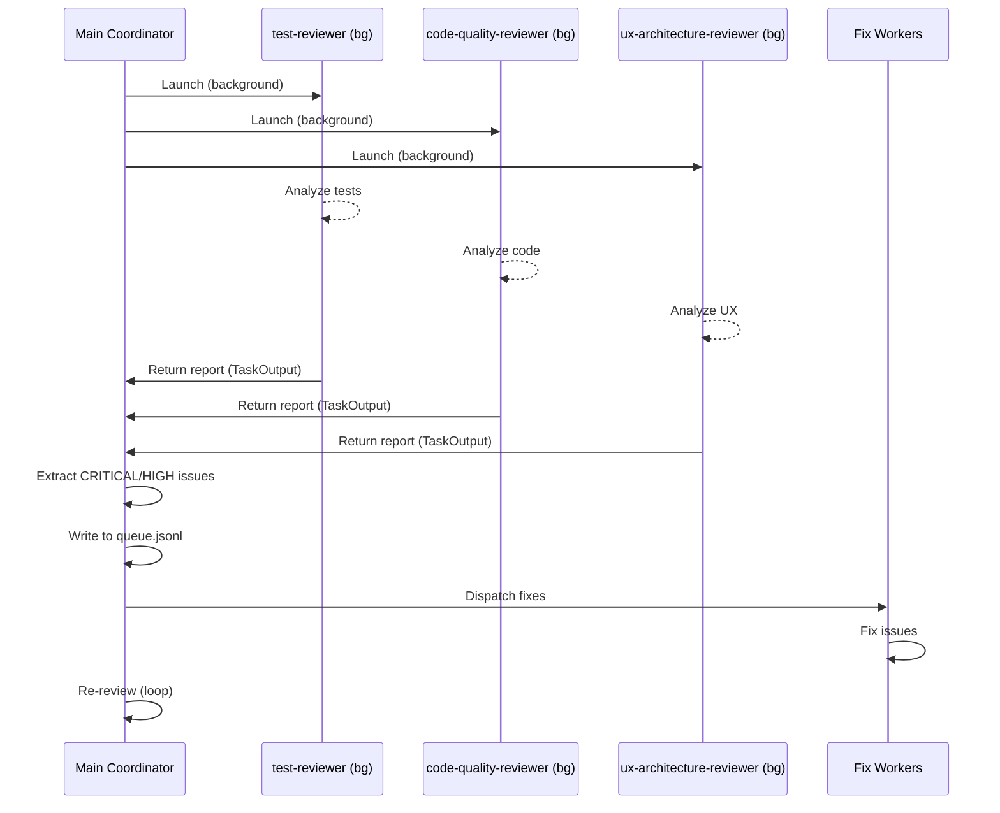
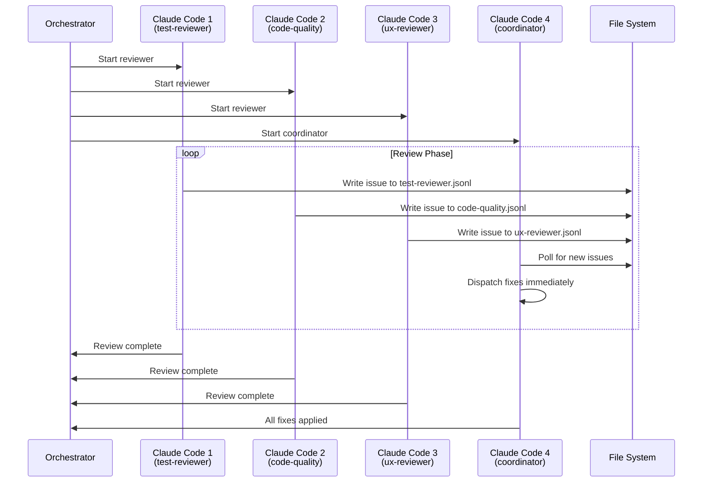
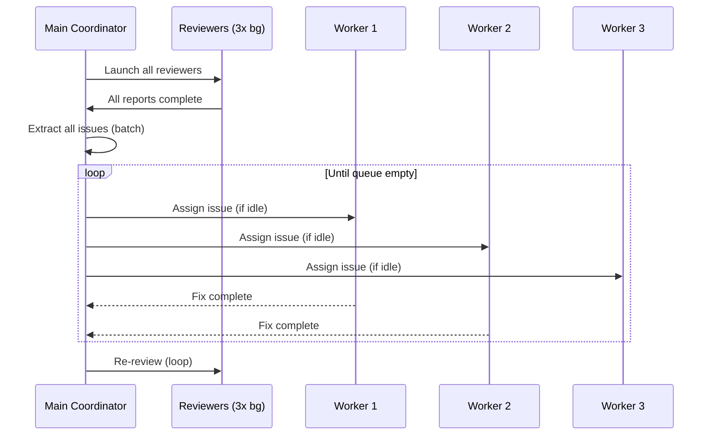

# Multi-Process Parallel Review Architecture

**Status:** Design Proposal
**Related Research:** [Claude Code Subagent Limitations](../research/claude-code-subagent-limitations.md)

## Problem Statement

Automated code review requires running multiple specialized reviewers in parallel to maximize efficiency. Ideally, the system should:

1. **Run reviewers in parallel** - 3+ reviewers analyzing different aspects simultaneously
2. **Stream results in real-time** - Start fixing issues while reviews are ongoing
3. **Coordinate work** - Avoid duplicate fixes, manage worker pool
4. **Loop until clean** - Re-review after fixes until CRITICAL/HIGH issues = 0

However, Claude Code's subagent limitations prevent background agents from writing to files, making traditional queue-based architectures infeasible.

## Constraint: Subagent File I/O Limitation

As documented in [Claude Code Subagent Limitations](../research/claude-code-subagent-limitations.md):

- **Background subagents cannot write files** (Edit/Write tools auto-denied)
- **Foreground subagents require user approval** (blocks parallelism)
- **Settings.json permissions don't propagate** to subagents

This rules out architectures where reviewers write directly to shared queue files.

## Architecture Options

### Option A: Batch Processing with Subagents (Current Implementation)

**Architecture:**
```
Main Coordinator (Primary Agent)
  ├─ Launch 3 Reviewers in background (read-only)
  ├─ Wait for all to complete (TaskOutput)
  ├─ Extract CRITICAL/HIGH issues from reports
  ├─ Write issues to queue files
  └─ Dispatch to fix workers (backend/frontend specialists)
```

**Flow:**


**Pros:**
- ✅ Works within Claude Code constraints
- ✅ True parallelism during review phase
- ✅ No external dependencies
- ✅ Single Claude Code process

**Cons:**
- ❌ Cannot start fixing until all reviews complete
- ❌ No real-time streaming
- ❌ Batch processing delay

**Complexity:** Low
**Feasibility:** High (already implemented in `/review-loop` command)

---

### Option B: Multiple Independent Claude Code Processes

**Architecture:**
```
Process 1: Claude Code → test-reviewer
  └─ Writes: .claude/review-queue/test-reviewer.jsonl

Process 2: Claude Code → code-quality-reviewer
  └─ Writes: .claude/review-queue/code-quality-reviewer.jsonl

Process 3: Claude Code → ux-architecture-reviewer
  └─ Writes: .claude/review-queue/ux-architecture-reviewer.jsonl

Process 4: Claude Code → Main Coordinator
  ├─ Polls: *.jsonl files
  ├─ Dispatches: fix workers
  └─ Manages: review loop
```

**Flow:**


**Communication Protocol:**

Each reviewer writes JSONLines format:
```json
{"severity":"CRITICAL","file":"path/to/file.ts","line":123,"description":"...","recommendation":"..."}
{"severity":"HIGH","file":"path/to/file.ts","line":456,"description":"...","recommendation":"..."}
```

Main coordinator polls files:
```javascript
// Pseudocode
while (reviewers_running || queue_not_empty) {
  for each reviewer_file {
    new_issues = read_new_lines(file, last_offset)
    for each issue {
      if (worker_available) {
        dispatch_to_worker(issue)
      } else {
        append_to_overflow_queue(issue)
      }
    }
  }
  sleep(poll_interval)
}
```

**Pros:**
- ✅ True parallel execution with file I/O
- ✅ Real-time streaming - fixes start immediately
- ✅ Each Claude Code is primary agent (can write files)
- ✅ Natural scaling - add more reviewers = add more processes

**Cons:**
- ❌ Requires external orchestration
- ❌ Higher resource usage (4 Claude Code processes)
- ❌ Process management complexity
- ❌ Need coordination for review loop restarts

**Complexity:** High
**Feasibility:** Medium (requires integration with agent-console session management)

---

### Option C: Hybrid - Batch Reviews + Streaming Fixes

**Architecture:**
```
Main Coordinator
  ├─ Launch reviewers in background (batch)
  ├─ Extract all issues immediately after completion
  ├─ Write to queue.jsonl
  └─ Stream fixes via worker pool (parallel)
      ├─ Worker 1: frontend-specialist (bg)
      ├─ Worker 2: backend-specialist (bg)
      └─ Worker 3: backend-specialist (bg)
```

**Flow:**


**Pros:**
- ✅ Works within Claude Code constraints
- ✅ Parallel fixing phase
- ✅ Better resource utilization than pure batch

**Cons:**
- ❌ Review phase still batched
- ❌ No real-time review streaming

**Complexity:** Medium
**Feasibility:** High

---

## Recommendation

### Immediate (Current Sprint): Option A - Batch Processing

**Rationale:**
- Already implemented in `/review-loop` command
- No additional infrastructure required
- Proven to work within constraints
- Sufficient for most use cases

**Implementation Status:** Complete (needs testing)

### Future Enhancement: Option B - Multi-Process

**When to Consider:**
- Agent-console session management can orchestrate multiple Claude Code instances
- Large codebases where streaming reviews provide significant UX improvement
- Resource overhead (4+ processes) is acceptable

**Prerequisites:**
1. **Session orchestration API**
   - Programmatically create sessions
   - Assign specific prompts/agents to sessions
   - Monitor session completion status

2. **File-based coordination**
   - Implement polling mechanism
   - Handle concurrent writes (append-only JSONLines)
   - Cleanup on completion

3. **Process lifecycle management**
   - Start reviewers with specific prompts
   - Detect completion (exit or marker file)
   - Handle failures and restarts

**Estimated Effort:** 2-3 days
- Day 1: Orchestration API design + session management integration
- Day 2: File polling + worker dispatch logic
- Day 3: Testing + edge case handling

### Not Recommended: Option C

**Rationale:**
- Complexity doesn't justify incremental improvement over Option A
- Review phase is still batched (main bottleneck)
- Option B provides better ROI if we're going to add complexity

## Implementation Details for Option B

### Agent-Console Integration

Leverage existing session management:

```typescript
// Orchestrator pseudo-code
async function runParallelReviewLoop() {
  // Create 4 sessions in the current worktree
  const sessions = await Promise.all([
    sessionManager.createSession({
      worktreePath: process.cwd(),
      initialCommand: 'claude code --agent test-reviewer --output .claude/review-queue/test-reviewer.jsonl'
    }),
    sessionManager.createSession({
      worktreePath: process.cwd(),
      initialCommand: 'claude code --agent code-quality-reviewer --output .claude/review-queue/code-quality.jsonl'
    }),
    sessionManager.createSession({
      worktreePath: process.cwd(),
      initialCommand: 'claude code --agent ux-architecture-reviewer --output .claude/review-queue/ux-reviewer.jsonl'
    }),
    sessionManager.createSession({
      worktreePath: process.cwd(),
      initialCommand: 'claude code --agent review-coordinator'
    })
  ]);

  // Monitor completion
  await waitForReviewCompletion(sessions);
}
```

### File Polling Strategy

```typescript
interface IssueTracker {
  file: string;
  lastOffset: number;
  processedCount: number;
}

async function pollReviewerFiles(
  files: string[],
  onNewIssue: (issue: Issue) => void
): Promise<void> {
  const trackers: Map<string, IssueTracker> = new Map();

  while (reviewersRunning() || queueNotEmpty()) {
    for (const file of files) {
      const tracker = trackers.get(file) || { file, lastOffset: 0, processedCount: 0 };
      const newIssues = await readNewLines(file, tracker.lastOffset);

      for (const issue of newIssues) {
        onNewIssue(issue);
        tracker.processedCount++;
      }

      tracker.lastOffset = getFileSize(file);
      trackers.set(file, tracker);
    }

    await sleep(POLL_INTERVAL_MS); // 500ms
  }
}
```

### Worker Dispatch Logic

```typescript
class WorkerPool {
  private workers: Worker[] = [
    { id: 'frontend-1', type: 'frontend-specialist', busy: false },
    { id: 'backend-1', type: 'backend-specialist', busy: false },
    { id: 'backend-2', type: 'backend-specialist', busy: false },
  ];

  private overflowQueue: Issue[] = [];

  async dispatch(issue: Issue): Promise<void> {
    const worker = this.findIdleWorker(issue.file);

    if (worker) {
      worker.busy = true;
      await this.assignToWorker(worker, issue);
      worker.busy = false;
    } else {
      this.overflowQueue.push(issue);
    }
  }

  private findIdleWorker(file: string): Worker | null {
    const type = file.startsWith('packages/client/') ? 'frontend-specialist' : 'backend-specialist';
    return this.workers.find(w => !w.busy && w.type === type) || null;
  }
}
```

## Open Questions

1. **Process Lifecycle:**
   - How to detect when a reviewer has completed (all issues written)?
   - Marker file (`.done`)? Process exit? Timeout?

2. **Error Handling:**
   - What if a reviewer crashes mid-execution?
   - Should coordinator restart failed reviewers?

3. **Review Loop:**
   - After fixes are applied, how to restart all 3 reviewers?
   - Terminate old processes and spawn new ones?
   - Or send "re-review" command via stdin?

4. **Resource Management:**
   - Is 4 concurrent Claude Code processes acceptable?
   - Should we add throttling or process pooling?

5. **User Experience:**
   - How to show progress across 4 parallel sessions?
   - Terminal output multiplexing?
   - Web UI via agent-console dashboard?

## Alternatives Considered and Rejected

### ❌ WebSocket Coordination

**Idea:** Use agent-console's WebSocket infrastructure for reviewer coordination instead of files.

**Rejected Because:**
- Reviewers would still need to be primary agents (separate processes)
- WebSocket adds complexity without solving core constraint
- File-based approach is simpler and more debuggable

### ❌ Database Queue

**Idea:** Use SQLite database for queue management (like existing job queue).

**Rejected Because:**
- Same fundamental issue: background subagents can't write to DB
- Adds dependency without solving root problem
- File-based JSONLines is simpler for append-only pattern

### ❌ IPC via Named Pipes

**Idea:** Use Unix named pipes for inter-process communication.

**Rejected Because:**
- More complex than file-based approach
- Not cross-platform (Windows compatibility issues)
- Debugging is harder

## Success Metrics

If implementing Option B, measure:

1. **Performance:**
   - Time to first fix (Option B should be faster)
   - Total review loop time (should be similar)
   - Resource usage (CPU, memory for 4 processes)

2. **Reliability:**
   - Review completion rate
   - Fix success rate
   - Process crash recovery

3. **User Experience:**
   - Perceived responsiveness
   - Progress visibility
   - Error clarity

## Related Documents

- [Claude Code Subagent Limitations](../research/claude-code-subagent-limitations.md) - Technical investigation
- [WebSocket Protocol](./websocket-protocol.md) - Existing real-time coordination patterns
- [Testing Guidelines](../testing-guidelines.md) - Review quality standards

## Conclusion

**Short-term:** Use Option A (Batch Processing) - it's proven, simple, and sufficient.

**Long-term:** Consider Option B (Multi-Process) if agent-console's session orchestration capabilities make it natural to coordinate multiple Claude Code instances. The key insight is that **independent processes bypass the subagent limitation** because each is a primary agent with full file write permissions.

The architecture choice should be driven by actual user pain points: if batch processing latency becomes a bottleneck for large codebases, invest in multi-process streaming. Otherwise, stick with the simpler batch approach.
