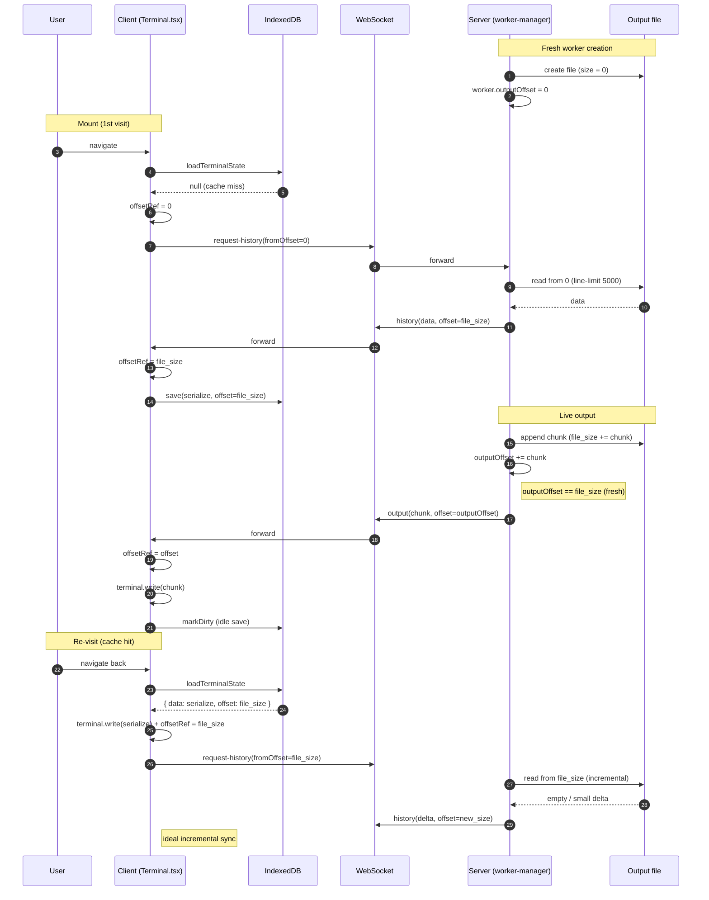
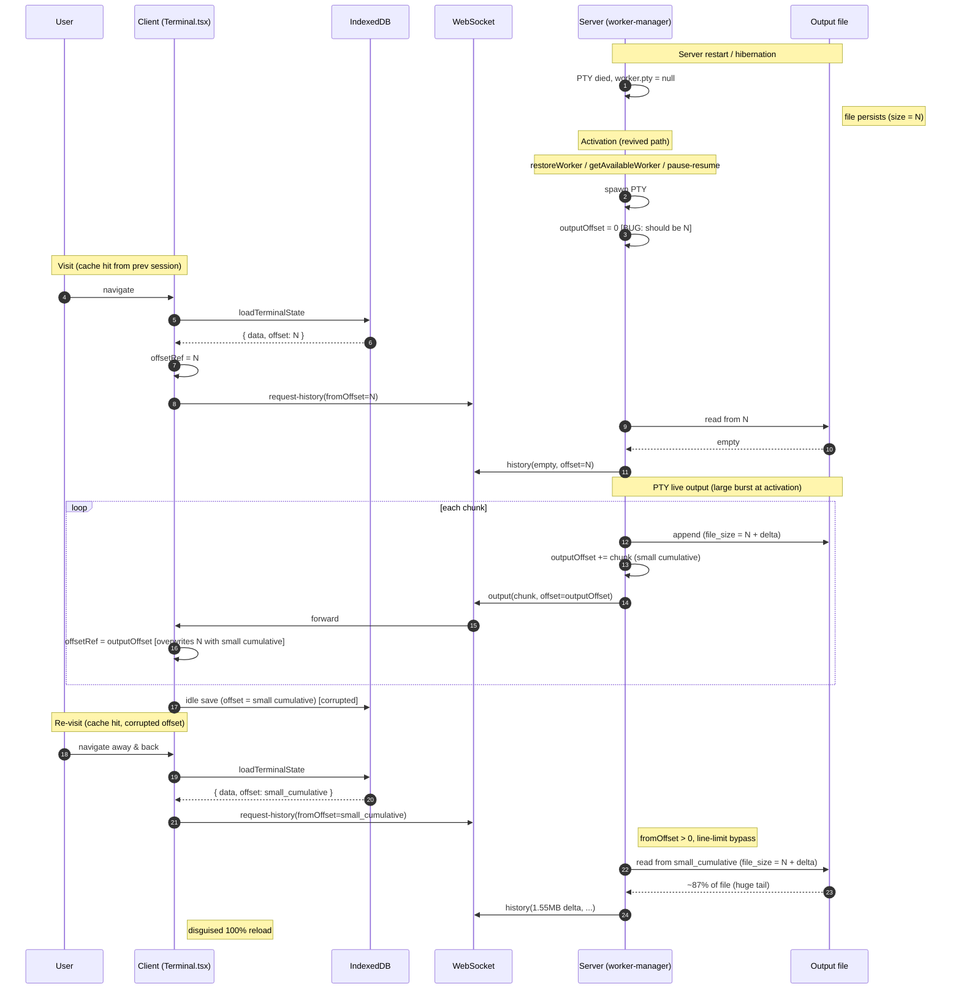

# WebSocket Protocol Design

This document defines the WebSocket protocol used for real-time communication between client and server.

## Endpoints

| Endpoint | Purpose |
|----------|---------|
| `/ws/app` | App-wide state synchronization (sessions, worker activity) |
| `/ws/session/:sessionId/worker/:workerId` | Individual worker I/O (terminal input/output) |

## App Connection (`/ws/app`)

Singleton WebSocket connection for app-wide state synchronization. Persists across route navigation.

### Server → Client Messages

| Type | Payload | Description |
|------|---------|-------------|
| `sessions-sync` | `{ sessions: Session[], activityStates: WorkerActivityInfo[] }` | Full session list with activity states. Sent on initial connection and in response to `request-sync`. |
| `session-created` | `{ session: Session }` | New session created |
| `session-updated` | `{ session: Session }` | Session updated (title, branch, etc.) |
| `session-deleted` | `{ sessionId: string }` | Session deleted |
| `session-paused` | `{ sessionId: string }` | Session paused (removed from memory, preserved in database) |
| `session-resumed` | `{ session: Session }` | Session resumed (restored from database to memory) |
| `worker-activity` | `{ sessionId, workerId, activityState }` | Worker activity state changed |
| `worker-restarted` | `{ sessionId: string, workerId: string }` | Worker PTY was restarted. Clients should clear cached terminal state and reconnect the worker WebSocket. |
| `inbound-event` | `{ sessionId: string, event: InboundEventSummary }` | Inbound integration event notification |

### Client → Server Messages

| Type | Payload | Description |
|------|---------|-------------|
| `request-sync` | (none) | Request full session sync |

### Design Decisions

#### Why `request-sync` exists

The WebSocket connection is a singleton that persists across route navigation. When users navigate away from Dashboard and return, the connection is already established, so the server doesn't send `sessions-sync` automatically (which only happens on `onOpen`).

The client sends `request-sync` when Dashboard mounts and the WebSocket is already connected, ensuring fresh state after navigation.

#### Future Extension: scope parameter

Currently, `request-sync` only returns session data. If future pages require different data via WebSocket, the protocol can be extended with a `scope` parameter:

```typescript
// Current (implicit scope: sessions)
{ type: 'request-sync' }

// Future extension
{ type: 'request-sync', scope: 'sessions' }
{ type: 'request-sync', scope: ['sessions', 'agents'] }
```

This is similar to SQL JOINs - explicitly specifying what data to fetch. The server would respond with the appropriate `*-sync` message(s).

**Note:** Only add scope when there's a concrete need. Static data (agents, repositories) should use REST API unless real-time sync is required.

## Worker Connection (`/ws/session/:sessionId/worker/:workerId`)

Per-worker WebSocket for terminal I/O.

### Client → Server Messages

| Type | Payload | Description |
|------|---------|-------------|
| `input` | `{ data: string }` | Terminal input |
| `resize` | `{ cols: number, rows: number }` | Terminal resize |
| `image` | `{ data: string, mimeType: string }` | Image data (base64) |
| `request-history` | `{ fromOffset?: number }` | Request terminal history. If `fromOffset` is provided, returns only data after that byte offset (incremental sync). |

### Server → Client Messages

| Type | Payload | Description |
|------|---------|-------------|
| `output` | `{ data: string, offset: number }` | PTY output with current byte offset |
| `exit` | `{ exitCode: number, signal: string \| null }` | Process exit |
| `history` | `{ data: string, offset: number, timedOut?: boolean }` | Terminal output history with current offset. `timedOut: true` if history load timed out (client can continue without full history). |
| `activity` | `{ state: AgentActivityState }` | Agent activity state change (agent workers only) |
| `output-truncated` | `{ message: string, newOffset: number }` | Output file was truncated (size cap exceeded). `newOffset` is the new file-absolute byte position the client should use for any subsequent `request-history`. Client must invalidate / rebase its cached terminal state to this offset. |
| `error` | `{ message: string, code?: WorkerErrorCode }` | Error notification (e.g., worker not found) |

### Output Offset Semantics

All `offset` fields exchanged over the worker WebSocket — `output.offset`,
`history.offset`, `output-truncated.newOffset`, and the client-cached
`fromOffset` — represent **the absolute byte position from the start of the
worker's persistent output file**. They are never cumulative since PTY
activation, and never reset on hibernation / resume.

The server keeps a single source of truth for this offset:
`worker.outputOffset` is advanced per write by the byte length of the chunk
being appended to the output file, and the file size on disk is the
authoritative reference whenever the in-memory counter is reseeded.

#### Lifecycle phase × offset table

| Phase | `worker.outputOffset` (server) | `output.offset` (event) | `history.offset` (event) | `output-truncated.newOffset` |
|---|---|---|---|---|
| `createWorker` (fresh) | `0` (file size = 0) | file-absolute | file-absolute | — |
| live output | advances by chunk byte length per write (= file size) | file-absolute | file-absolute | — |
| PTY died (server restart / hibernation) | last value frozen, `pty = null` | — (no live output) | file-absolute (read from file) | — |
| **Activation (revived)** | **seeded from `getCurrentOffset()` (file size) before PTY spawn** | file-absolute | file-absolute | — |
| `restartWorker` | `0` (file truncated to 0 by `resetWorkerOutput`) | file-absolute | file-absolute | — |
| Truncation (>10MB cap) | trimmed file size | file-absolute | file-absolute | trimmed file size |

The "revived" row is the contract enforced by the
`AgentActivationParams.revived` / `TerminalActivationParams.revived` flag
(true for `restoreWorker`, `getAvailableWorker` activation, and pause/resume;
false for `createWorker` and `restartWorker`). Without that seed, the
counter restarts from `0` after every revival and silently drifts away from
the file-absolute offset that the client's IndexedDB cache holds — see
sequence (b) below.

The client's `offsetRef` mirrors the same semantic: it stores whatever
file-absolute value it most recently observed (from `history.offset` /
`output.offset` / a cache hit) and only ever feeds that value back to the
server via `request-history.fromOffset`.

#### Sequence (a) — normal happy path (fresh worker, no race window)



#### Sequence (b) — restoration race window (Issue #762 root cause)

This is the failure mode that exists when the activation path forgets to
seed `worker.outputOffset` from the file size on revival. It is documented
here as the rationale for the "revived" row in the table above.



### History Request Behavior

When a Terminal component mounts, it requests terminal history to display previous output.

**Incremental Sync (Offset-based):**
- Client caches terminal state in IndexedDB with the last known `offset`
- On mount, client restores cached state and sends `request-history` with `fromOffset`
- Server returns only data after that offset (incremental sync)
- This eliminates flicker when switching between worker tabs

**Full History Request:**
- If no cache exists or cache is invalid, client sends `request-history` without `fromOffset`
- Server returns full history from the beginning

**Timeout Protection:**
- Server-side timeout: 5 seconds
- If history retrieval times out, server sends `history` with `timedOut: true` and empty data
- Client can continue using the terminal without full history (graceful degradation)

**Fallback Behavior:**
- Primary: Read from persistent file storage with offset support
- Fallback: Use in-memory buffer if file not available
- Timeout: Send `history` with `timedOut: true` (not an error)

See [terminal-state-sync.md](./terminal-state-sync.md) for detailed architecture.

## Reconnection Strategy

See [websocket-reconnection.md](../websocket-reconnection.md) for exponential backoff parameters.

Summary:
- Initial delay: 1s
- Max delay: 30s (with ±30% jitter)
- Backoff sequence: 1s → 2s → 4s → 8s → 16s → 30s → 30s...

## Type Definitions

See `packages/shared/src/types/session.ts` for:
- `APP_SERVER_MESSAGE_TYPES` - Valid server → client message types
- `APP_CLIENT_MESSAGE_TYPES` - Valid client → server message types
- `AppServerMessage` - Union type for server messages
- `AppClientMessage` - Union type for client messages
